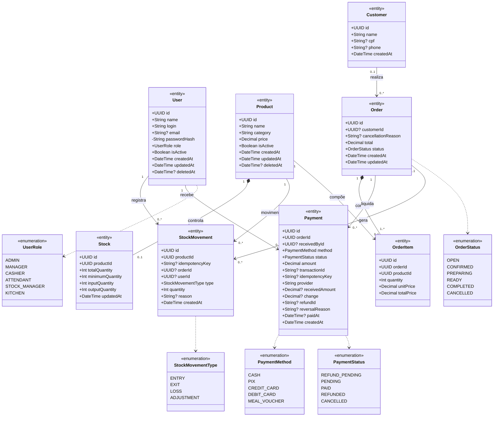

# UML — Diagrama de Classes: Domínio e Entidades

Modelo de domínio persistido no PostgreSQL via Prisma ORM, com suas enumerações, atributos, chaves e cardinalidades.

```mermaid
classDiagram
  direction TB

  class UserRole {
    <<enumeration>>
    ADMIN
    MANAGER
    CASHIER
    ATTENDANT
    STOCK_MANAGER
    KITCHEN
  }

  class StockMovementType {
    <<enumeration>>
    ENTRY
    EXIT
    LOSS
    ADJUSTMENT
  }

  class OrderStatus {
    <<enumeration>>
    OPEN
    CONFIRMED
    PREPARING
    READY
    COMPLETED
    CANCELLED
  }

  class PaymentMethod {
    <<enumeration>>
    CASH
    PIX
    CREDIT_CARD
    DEBIT_CARD
    MEAL_VOUCHER
  }

  class PaymentStatus {
    <<enumeration>>
    REFUND_PENDING
    PENDING
    PAID
    REFUNDED
    CANCELLED
  }

  class User {
    <<entity>>
    +UUID id
    +String name
    +String login
    +String? email
    -String passwordHash
    +UserRole role
    +Boolean isActive
    +DateTime createdAt
    +DateTime updatedAt
    +DateTime? deletedAt
  }

  class Customer {
    <<entity>>
    +UUID id
    +String name
    +String? cpf
    +String? phone
    +DateTime createdAt
  }

  class Product {
    <<entity>>
    +UUID id
    +String name
    +String category
    +Decimal price
    +Boolean isActive
    +DateTime createdAt
    +DateTime updatedAt
    +DateTime? deletedAt
  }

  class Stock {
    <<entity>>
    +UUID id
    +UUID productId
    +Int totalQuantity
    +Int minimumQuantity
    +Int inputQuantity
    +Int outputQuantity
    +DateTime updatedAt
  }

  class StockMovement {
    <<entity>>
    +UUID id
    +UUID productId
    +String? idempotencyKey
    +UUID? orderId
    +UUID? userId
    +StockMovementType type
    +Int quantity
    +String? reason
    +DateTime createdAt
  }

  class Order {
    <<entity>>
    +UUID id
    +UUID? customerId
    +String? cancellationReason
    +Decimal total
    +OrderStatus status
    +DateTime createdAt
    +DateTime updatedAt
  }

  class OrderItem {
    <<entity>>
    +UUID id
    +UUID orderId
    +UUID productId
    +Int quantity
    +Decimal unitPrice
    +Decimal totalPrice
  }

  class Payment {
    <<entity>>
    +UUID id
    +UUID orderId
    +UUID? receivedById
    +PaymentMethod method
    +PaymentStatus status
    +Decimal amount
    +String? transactionId
    +String? idempotencyKey
    +String provider
    +Decimal? receivedAmount
    +Decimal? change
    +String? refundId
    +String? reversalReason
    +DateTime? paidAt
    +DateTime createdAt
  }

  User "1" --> "0..*" StockMovement : registra
  User "1" --> "0..*" Payment : recebe
  User ..> UserRole

  Customer "0..1" --> "0..*" Order : realiza

  Product "1" *-- "0..1" Stock : controla
  Product "1" --> "0..*" StockMovement : movimenta
  Product "1" --> "0..*" OrderItem : compõe

  Order "1" *-- "1..*" OrderItem : contém
  Order "1" --> "0..*" Payment : liquida
  Order "0..1" --> "0..*" StockMovement : gera
  Order ..> OrderStatus

  StockMovement ..> StockMovementType
  Payment ..> PaymentMethod
  Payment ..> PaymentStatus
```
