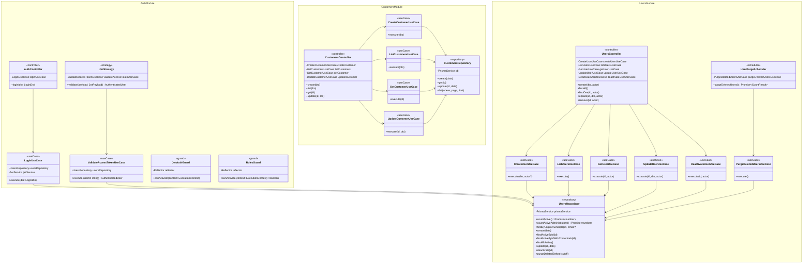

# UML — Diagrama de Classes: Auth, Users e Customers

Arquitetura em camadas (Controller, Guards/Strategy, Use Cases, Scheduler e Repositories) dos módulos de identidade, usuários e clientes.

```mermaid
classDiagram
  direction TB

  namespace AuthModule {
    class AuthController {
      <<controller>>
      -LoginUseCase loginUseCase
      +login(dto: LoginDto)
    }

    class LoginUseCase {
      <<useCase>>
      -UsersRepository usersRepository
      -JwtService jwtService
      +execute(dto: LoginDto)
    }

    class ValidateAccessTokenUseCase {
      <<useCase>>
      -UsersRepository usersRepository
      +execute(userId: string) AuthenticatedUser
    }

    class JwtAuthGuard {
      <<guard>>
      -Reflector reflector
      +canActivate(context: ExecutionContext)
    }

    class RolesGuard {
      <<guard>>
      -Reflector reflector
      +canActivate(context: ExecutionContext) boolean
    }

    class JwtStrategy {
      <<strategy>>
      -ValidateAccessTokenUseCase validateAccessTokenUseCase
      +validate(payload: JwtPayload) AuthenticatedUser
    }
  }

  namespace UsersModule {
    class UsersController {
      <<controller>>
      -CreateUserUseCase createUserUseCase
      -ListUsersUseCase listUsersUseCase
      -GetUserUseCase getUserUseCase
      -UpdateUserUseCase updateUserUseCase
      -DeactivateUserUseCase deactivateUserUseCase
      +create(dto, actor)
      +findAll()
      +findOne(id, actor)
      +update(id, dto, actor)
      +remove(id, actor)
    }

    class UserPurgeScheduler {
      <<scheduler>>
      -PurgeDeletedUsersUseCase purgeDeletedUsersUseCase
      +purgeDeletedUsers() Promise~CountResult~
    }

    class UsersRepository {
      <<repository>>
      -PrismaService prismaService
      +countActive() Promise~number~
      +countActiveAdministrators() Promise~number~
      +findByLoginOrEmail(login, email?)
      +create(data)
      +findActiveById(id)
      +findActiveByIdWithCredentials(id)
      +findAllActive()
      +update(id, data)
      +deactivate(id)
      +purgeDeletedBefore(cutoff)
    }

    class CreateUserUseCase {
      <<useCase>>
      +execute(dto, actor?)
    }

    class ListUsersUseCase {
      <<useCase>>
      +execute()
    }

    class GetUserUseCase {
      <<useCase>>
      +execute(id, actor)
    }

    class UpdateUserUseCase {
      <<useCase>>
      +execute(id, dto, actor)
    }

    class DeactivateUserUseCase {
      <<useCase>>
      +execute(id, actor)
    }

    class PurgeDeletedUsersUseCase {
      <<useCase>>
      +execute()
    }
  }

  namespace CustomersModule {
    class CustomersController {
      <<controller>>
      -CreateCustomerUseCase createCustomer
      -ListCustomersUseCase listCustomers
      -GetCustomerUseCase getCustomer
      -UpdateCustomerUseCase updateCustomer
      +create(dto)
      +list(dto)
      +get(id)
      +update(id, dto)
    }

    class CustomersRepository {
      <<repository>>
      -PrismaService db
      +create(data)
      +get(id)
      +update(id, data)
      +list(where, page, limit)
    }

    class CreateCustomerUseCase {
      <<useCase>>
      +execute(dto)
    }

    class ListCustomersUseCase {
      <<useCase>>
      +execute(dto)
    }

    class GetCustomerUseCase {
      <<useCase>>
      +execute(id)
    }

    class UpdateCustomerUseCase {
      <<useCase>>
      +execute(id, dto)
    }
  }

  AuthController --> LoginUseCase
  JwtStrategy --> ValidateAccessTokenUseCase
  LoginUseCase --> UsersRepository
  ValidateAccessTokenUseCase --> UsersRepository

  UsersController --> CreateUserUseCase
  UsersController --> ListUsersUseCase
  UsersController --> GetUserUseCase
  UsersController --> UpdateUserUseCase
  UsersController --> DeactivateUserUseCase
  UserPurgeScheduler --> PurgeDeletedUsersUseCase

  CreateUserUseCase --> UsersRepository
  ListUsersUseCase --> UsersRepository
  GetUserUseCase --> UsersRepository
  UpdateUserUseCase --> UsersRepository
  DeactivateUserUseCase --> UsersRepository
  PurgeDeletedUsersUseCase --> UsersRepository

  CustomersController --> CreateCustomerUseCase
  CustomersController --> ListCustomersUseCase
  CustomersController --> GetCustomerUseCase
  CustomersController --> UpdateCustomerUseCase

  CreateCustomerUseCase --> CustomersRepository
  ListCustomersUseCase --> CustomersRepository
  GetCustomerUseCase --> CustomersRepository
  UpdateCustomerUseCase --> CustomersRepository
```
