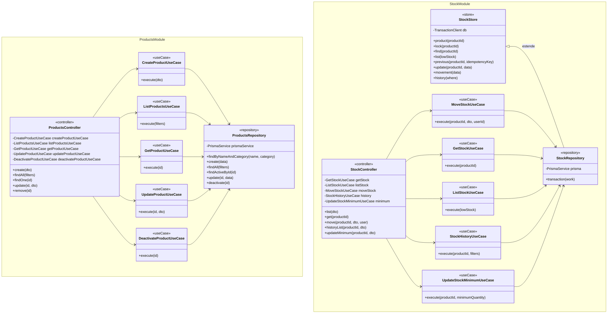

# UML — Diagrama de Classes: Catálogo e Estoque

Arquitetura em camadas dos módulos **Products** e **Stock** (incluindo o padrão _Store_ transacional com `StockStore` / `StockRepository`).

```mermaid
classDiagram
  direction TB

  namespace ProductsModule {
    class ProductsController {
      <<controller>>
      -CreateProductUseCase createProductUseCase
      -ListProductsUseCase listProductsUseCase
      -GetProductUseCase getProductUseCase
      -UpdateProductUseCase updateProductUseCase
      -DeactivateProductUseCase deactivateProductUseCase
      +create(dto)
      +findAll(filters)
      +findOne(id)
      +update(id, dto)
      +remove(id)
    }

    class ProductsRepository {
      <<repository>>
      -PrismaService prismaService
      +findByNameAndCategory(name, category)
      +create(data)
      +findAll(filters)
      +findActiveById(id)
      +update(id, data)
      +deactivate(id)
    }

    class CreateProductUseCase {
      <<useCase>>
      +execute(dto)
    }

    class ListProductsUseCase {
      <<useCase>>
      +execute(filters)
    }

    class GetProductUseCase {
      <<useCase>>
      +execute(id)
    }

    class UpdateProductUseCase {
      <<useCase>>
      +execute(id, dto)
    }

    class DeactivateProductUseCase {
      <<useCase>>
      +execute(id)
    }
  }

  namespace StockModule {
    class StockController {
      <<controller>>
      -GetStockUseCase getStock
      -ListStockUseCase listStock
      -MoveStockUseCase moveStock
      -StockHistoryUseCase history
      -UpdateStockMinimumUseCase minimum
      +list(dto)
      +get(productId)
      +move(productId, dto, user)
      +historyList(productId, dto)
      +updateMinimum(productId, dto)
    }

    class StockStore {
      <<store>>
      -TransactionClient db
      +product(productId)
      +lock(productId)
      +find(productId)
      +list(lowStock)
      +previous(productId, idempotencyKey)
      +update(productId, data)
      +movement(data)
      +history(where)
    }

    class StockRepository {
      <<repository>>
      -PrismaService prisma
      +transaction(work)
    }

    class MoveStockUseCase {
      <<useCase>>
      +execute(productId, dto, userId)
    }

    class GetStockUseCase {
      <<useCase>>
      +execute(productId)
    }

    class ListStockUseCase {
      <<useCase>>
      +execute(lowStock)
    }

    class StockHistoryUseCase {
      <<useCase>>
      +execute(productId, filters)
    }

    class UpdateStockMinimumUseCase {
      <<useCase>>
      +execute(productId, minimumQuantity)
    }
  }

  StockStore <|-- StockRepository : estende

  ProductsController --> CreateProductUseCase
  ProductsController --> ListProductsUseCase
  ProductsController --> GetProductUseCase
  ProductsController --> UpdateProductUseCase
  ProductsController --> DeactivateProductUseCase

  CreateProductUseCase --> ProductsRepository
  ListProductsUseCase --> ProductsRepository
  GetProductUseCase --> ProductsRepository
  UpdateProductUseCase --> ProductsRepository
  DeactivateProductUseCase --> ProductsRepository

  StockController --> GetStockUseCase
  StockController --> ListStockUseCase
  StockController --> MoveStockUseCase
  StockController --> StockHistoryUseCase
  StockController --> UpdateStockMinimumUseCase

  MoveStockUseCase --> StockRepository
  GetStockUseCase --> StockRepository
  ListStockUseCase --> StockRepository
  StockHistoryUseCase --> StockRepository
  UpdateStockMinimumUseCase --> StockRepository
```
