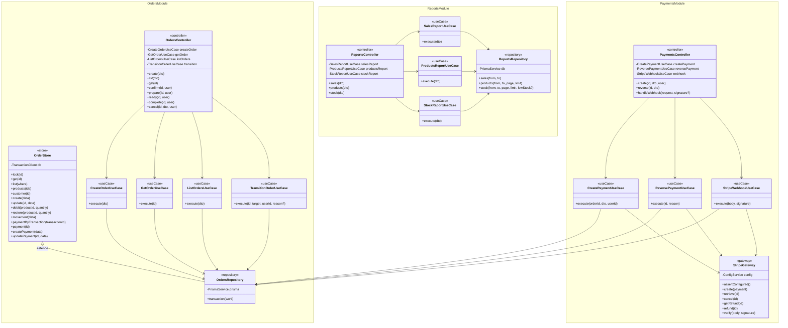

# UML — Diagrama de Classes: Pedidos, Pagamentos e Relatórios

Arquitetura dos módulos transacionais (**Orders**, **Payments**) e analítico (**Reports**).

```mermaid
classDiagram
  direction TB

  namespace OrdersModule {
    class OrdersController {
      <<controller>>
      -CreateOrderUseCase createOrder
      -GetOrderUseCase getOrder
      -ListOrdersUseCase listOrders
      -TransitionOrderUseCase transition
      +create(dto)
      +list(dto)
      +get(id)
      +confirm(id, user)
      +prepare(id, user)
      +ready(id, user)
      +complete(id, user)
      +cancel(id, dto, user)
    }

    class OrderStore {
      <<store>>
      -TransactionClient db
      +lock(id)
      +get(id)
      +list(where)
      +products(ids)
      +customer(id)
      +create(data)
      +update(id, data)
      +debit(productId, quantity)
      +restore(productId, quantity)
      +movement(data)
      +paymentByTransaction(transactionId)
      +payment(id)
      +createPayment(data)
      +updatePayment(id, data)
    }

    class OrdersRepository {
      <<repository>>
      -PrismaService prisma
      +transaction(work)
    }

    class CreateOrderUseCase {
      <<useCase>>
      +execute(dto)
    }

    class GetOrderUseCase {
      <<useCase>>
      +execute(id)
    }

    class ListOrdersUseCase {
      <<useCase>>
      +execute(dto)
    }

    class TransitionOrderUseCase {
      <<useCase>>
      +execute(id, target, userId, reason?)
    }
  }

  namespace PaymentsModule {
    class PaymentsController {
      <<controller>>
      -CreatePaymentUseCase createPayment
      -ReversePaymentUseCase reversePayment
      -StripeWebhookUseCase webhook
      +create(id, dto, user)
      +reverse(id, dto)
      +handleWebhook(request, signature?)
    }

    class StripeGateway {
      <<gateway>>
      -ConfigService config
      +assertConfigured()
      +create(payment)
      +retrieve(id)
      +cancel(id)
      +getRefund(id)
      +refund(id)
      +verify(body, signature)
    }

    class CreatePaymentUseCase {
      <<useCase>>
      +execute(orderId, dto, userId)
    }

    class ReversePaymentUseCase {
      <<useCase>>
      +execute(id, reason)
    }

    class StripeWebhookUseCase {
      <<useCase>>
      +execute(body, signature)
    }
  }

  namespace ReportsModule {
    class ReportsController {
      <<controller>>
      -SalesReportUseCase salesReport
      -ProductsReportUseCase productsReport
      -StockReportUseCase stockReport
      +sales(dto)
      +products(dto)
      +stock(dto)
    }

    class ReportsRepository {
      <<repository>>
      -PrismaService db
      +sales(from, to)
      +products(from, to, page, limit)
      +stock(from, to, page, limit, lowStock?)
    }

    class SalesReportUseCase {
      <<useCase>>
      +execute(dto)
    }

    class ProductsReportUseCase {
      <<useCase>>
      +execute(dto)
    }

    class StockReportUseCase {
      <<useCase>>
      +execute(dto)
    }
  }

  OrderStore <|-- OrdersRepository : estende

  OrdersController --> CreateOrderUseCase
  OrdersController --> GetOrderUseCase
  OrdersController --> ListOrdersUseCase
  OrdersController --> TransitionOrderUseCase

  CreateOrderUseCase --> OrdersRepository
  GetOrderUseCase --> OrdersRepository
  ListOrdersUseCase --> OrdersRepository
  TransitionOrderUseCase --> OrdersRepository

  PaymentsController --> CreatePaymentUseCase
  PaymentsController --> ReversePaymentUseCase
  PaymentsController --> StripeWebhookUseCase

  CreatePaymentUseCase --> OrdersRepository
  CreatePaymentUseCase --> StripeGateway
  ReversePaymentUseCase --> OrdersRepository
  ReversePaymentUseCase --> StripeGateway
  StripeWebhookUseCase --> OrdersRepository
  StripeWebhookUseCase --> StripeGateway

  ReportsController --> SalesReportUseCase
  ReportsController --> ProductsReportUseCase
  ReportsController --> StockReportUseCase

  SalesReportUseCase --> ReportsRepository
  ProductsReportUseCase --> ReportsRepository
  StockReportUseCase --> ReportsRepository
```
