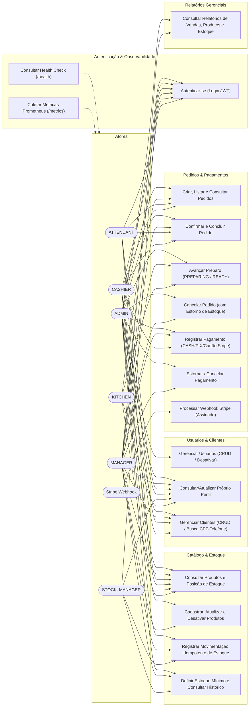

# Diagrama UML — Casos de Uso

Visão dos atores (perfis RBAC e sistema externo) e casos de uso implementados na **Food Service API**.

```mermaid
flowchart LR
  subgraph Atores
    ADMIN([ADMIN])
    MANAGER([MANAGER])
    ATTENDANT([ATTENDANT])
    CASHIER([CASHIER])
    STOCK_MGR([STOCK_MANAGER])
    KITCHEN([KITCHEN])
    STRIPE([Stripe Webhook])
  end

  subgraph Autenticacao_e_Sistema["Autenticação & Observabilidade"]
    UC_LOGIN["Autenticar-se (Login JWT)"]
    UC_HEALTH["Consultar Health Check (/health)"]
    UC_METRICS["Coletar Métricas Prometheus (/metrics)"]
  end

  subgraph Usuarios_e_Clientes["Usuários & Clientes"]
    UC_USERS["Gerenciar Usuários (CRUD / Desativar)"]
    UC_SELF["Consultar/Atualizar Próprio Perfil"]
    UC_CUSTOMERS["Gerenciar Clientes (CRUD / Busca CPF-Telefone)"]
  end

  subgraph Catalogo_e_Estoque["Catálogo & Estoque"]
    UC_PROD_READ["Consultar Produtos e Posição de Estoque"]
    UC_PROD_WRITE["Cadastrar, Atualizar e Desativar Produtos"]
    UC_STOCK_MOVE["Registrar Movimentação Idempotente de Estoque"]
    UC_STOCK_MIN["Definir Estoque Mínimo e Consultar Histórico"]
  end

  subgraph Pedidos_e_Pagamentos["Pedidos & Pagamentos"]
    UC_ORDER_CREATE["Criar, Listar e Consultar Pedidos"]
    UC_ORDER_CONFIRM["Confirmar e Concluir Pedido"]
    UC_ORDER_KITCHEN["Avançar Preparo (PREPARING / READY)"]
    UC_ORDER_CANCEL["Cancelar Pedido (com Estorno de Estoque)"]
    UC_PAY_CREATE["Registrar Pagamento (CASH/PIX/Cartão Stripe)"]
    UC_PAY_REVERSE["Estornar / Cancelar Pagamento"]
    UC_WEBHOOK["Processar Webhook Stripe (Assinado)"]
  end

  subgraph Relatorios["Relatórios Gerenciais"]
    UC_REPORTS["Consultar Relatórios de Vendas, Produtos e Estoque"]
  end

  ADMIN --> UC_USERS
  ADMIN --> UC_ORDER_CANCEL
  MANAGER --> UC_ORDER_CANCEL

  ADMIN --> UC_PROD_WRITE
  MANAGER --> UC_PROD_WRITE
  ADMIN --> UC_PAY_REVERSE
  MANAGER --> UC_PAY_REVERSE
  ADMIN --> UC_REPORTS
  MANAGER --> UC_REPORTS

  ADMIN --> UC_STOCK_MOVE
  MANAGER --> UC_STOCK_MOVE
  STOCK_MGR --> UC_STOCK_MOVE
  ADMIN --> UC_STOCK_MIN
  MANAGER --> UC_STOCK_MIN
  STOCK_MGR --> UC_STOCK_MIN

  ADMIN --> UC_PAY_CREATE
  MANAGER --> UC_PAY_CREATE
  CASHIER --> UC_PAY_CREATE

  ADMIN --> UC_CUSTOMERS
  MANAGER --> UC_CUSTOMERS
  ATTENDANT --> UC_CUSTOMERS
  CASHIER --> UC_CUSTOMERS

  ADMIN --> UC_ORDER_CREATE
  MANAGER --> UC_ORDER_CREATE
  ATTENDANT --> UC_ORDER_CREATE
  CASHIER --> UC_ORDER_CREATE
  ADMIN --> UC_ORDER_CONFIRM
  MANAGER --> UC_ORDER_CONFIRM
  ATTENDANT --> UC_ORDER_CONFIRM
  CASHIER --> UC_ORDER_CONFIRM

  ADMIN --> UC_ORDER_KITCHEN
  MANAGER --> UC_ORDER_KITCHEN
  KITCHEN --> UC_ORDER_KITCHEN

  ADMIN --> UC_PROD_READ
  MANAGER --> UC_PROD_READ
  ATTENDANT --> UC_PROD_READ
  CASHIER --> UC_PROD_READ
  STOCK_MGR --> UC_PROD_READ
  KITCHEN --> UC_PROD_READ

  ADMIN --> UC_LOGIN
  MANAGER --> UC_LOGIN
  ATTENDANT --> UC_LOGIN
  CASHIER --> UC_LOGIN
  STOCK_MGR --> UC_LOGIN
  KITCHEN --> UC_LOGIN

  ADMIN --> UC_SELF
  MANAGER --> UC_SELF
  ATTENDANT --> UC_SELF
  CASHIER --> UC_SELF
  STOCK_MGR --> UC_SELF
  KITCHEN --> UC_SELF

  STRIPE --> UC_WEBHOOK
  UC_HEALTH -.-> Atores
  UC_METRICS -.-> Atores
```
