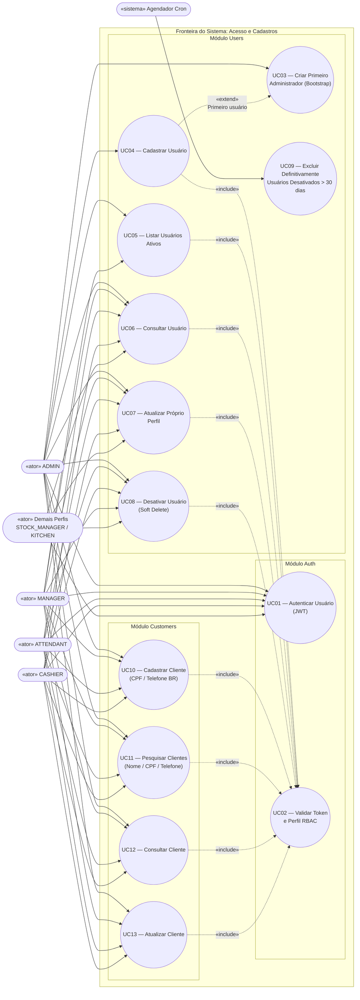

# UML — Casos de Uso: Acesso e Cadastros

Escopo: módulos **Auth**, **Users** e **Customers**.

```mermaid
flowchart LR
  %% Atores externos
  ADMIN([«ator» ADMIN])
  MANAGER([«ator» MANAGER])
  ATTENDANT([«ator» ATTENDANT])
  CASHIER([«ator» CASHIER])
  STAFF([«ator» Demais Perfis\nSTOCK_MANAGER / KITCHEN])
  SCHEDULER([«sistema» Agendador Cron])

  subgraph Sistema["Fronteira do Sistema: Acesso e Cadastros"]
    subgraph Auth["Módulo Auth"]
      UC_LOGIN(("UC01 — Autenticar Usuário\n(JWT)"))
      UC_VALIDATE(("UC02 — Validar Token\ne Perfil RBAC"))
    end

    subgraph Users["Módulo Users"]
      UC_USER_BOOTSTRAP(("UC03 — Criar Primeiro\nAdministrador (Bootstrap)"))
      UC_USER_CREATE(("UC04 — Cadastrar Usuário"))
      UC_USER_LIST(("UC05 — Listar Usuários Ativos"))
      UC_USER_GET(("UC06 — Consultar Usuário"))
      UC_USER_UPDATE(("UC07 — Atualizar Próprio Perfil"))
      UC_USER_DEACTIVATE(("UC08 — Desativar Usuário\n(Soft Delete)"))
      UC_USER_PURGE(("UC09 — Excluir Definitivamente\nUsuários Desativados > 30 dias"))
    end

    subgraph Customers["Módulo Customers"]
      UC_CUST_CREATE(("UC10 — Cadastrar Cliente\n(CPF / Telefone BR)"))
      UC_CUST_LIST(("UC11 — Pesquisar Clientes\n(Nome / CPF / Telefone)"))
      UC_CUST_GET(("UC12 — Consultar Cliente"))
      UC_CUST_UPDATE(("UC13 — Atualizar Cliente"))
    end
  end

  %% Relacionamentos dos atores
  ADMIN --> UC_LOGIN
  MANAGER --> UC_LOGIN
  ATTENDANT --> UC_LOGIN
  CASHIER --> UC_LOGIN
  STAFF --> UC_LOGIN

  ADMIN --> UC_USER_BOOTSTRAP
  ADMIN --> UC_USER_CREATE
  ADMIN --> UC_USER_LIST
  MANAGER --> UC_USER_LIST

  ADMIN --> UC_USER_GET
  MANAGER --> UC_USER_GET
  ATTENDANT --> UC_USER_GET
  CASHIER --> UC_USER_GET
  STAFF --> UC_USER_GET

  ADMIN --> UC_USER_UPDATE
  MANAGER --> UC_USER_UPDATE
  ATTENDANT --> UC_USER_UPDATE
  CASHIER --> UC_USER_UPDATE
  STAFF --> UC_USER_UPDATE

  ADMIN --> UC_USER_DEACTIVATE
  ATTENDANT --> UC_USER_DEACTIVATE
  CASHIER --> UC_USER_DEACTIVATE
  MANAGER --> UC_USER_DEACTIVATE
  STAFF --> UC_USER_DEACTIVATE

  SCHEDULER --> UC_USER_PURGE

  ADMIN --> UC_CUST_CREATE
  MANAGER --> UC_CUST_CREATE
  ATTENDANT --> UC_CUST_CREATE
  CASHIER --> UC_CUST_CREATE

  ADMIN --> UC_CUST_LIST
  MANAGER --> UC_CUST_LIST
  ATTENDANT --> UC_CUST_LIST
  CASHIER --> UC_CUST_LIST

  ADMIN --> UC_CUST_GET
  MANAGER --> UC_CUST_GET
  ATTENDANT --> UC_CUST_GET
  CASHIER --> UC_CUST_GET

  ADMIN --> UC_CUST_UPDATE
  MANAGER --> UC_CUST_UPDATE
  ATTENDANT --> UC_CUST_UPDATE
  CASHIER --> UC_CUST_UPDATE

  %% Inclusões e extensões UML
  UC_USER_CREATE -.->|«include»| UC_VALIDATE
  UC_USER_LIST -.->|«include»| UC_VALIDATE
  UC_USER_GET -.->|«include»| UC_VALIDATE
  UC_USER_UPDATE -.->|«include»| UC_VALIDATE
  UC_USER_DEACTIVATE -.->|«include»| UC_VALIDATE
  UC_CUST_CREATE -.->|«include»| UC_VALIDATE
  UC_CUST_LIST -.->|«include»| UC_VALIDATE
  UC_CUST_GET -.->|«include»| UC_VALIDATE
  UC_CUST_UPDATE -.->|«include»| UC_VALIDATE
  UC_USER_CREATE -.->|«extend»\nPrimeiro usuário| UC_USER_BOOTSTRAP
```
