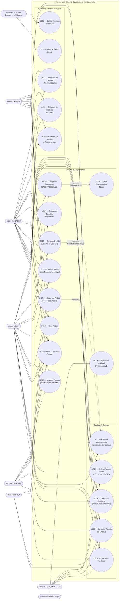

# UML — Casos de Uso: Operações, Relatórios e Observabilidade

Escopo: módulos **Products**, **Stock**, **Orders**, **Payments**, **Reports**, **Health** e **Observability**.

```mermaid
flowchart LR
  ADMIN([«ator» ADMIN])
  MANAGER([«ator» MANAGER])
  ATTENDANT([«ator» ATTENDANT])
  CASHIER([«ator» CASHIER])
  STOCK_MGR([«ator» STOCK_MANAGER])
  KITCHEN([«ator» KITCHEN])
  STRIPE([«sistema externo» Stripe])
  PROMETHEUS([«sistema externo» Prometheus / Monitor])

  subgraph Sistema["Fronteira do Sistema: Operações e Monitoramento"]
    subgraph CatalogoEstoque["Catálogo & Estoque"]
      UC_PROD_READ(("UC14 — Consultar Produtos"))
      UC_PROD_WRITE(("UC15 — Gerenciar Produtos\n(Criar / Editar / Desativar)"))
      UC_STOCK_READ(("UC16 — Consultar Posição\nde Estoque"))
      UC_STOCK_MOVE(("UC17 — Registrar Movimentação\nIdempotente de Estoque"))
      UC_STOCK_MIN(("UC18 — Definir Estoque Mínimo\ne Consultar Histórico"))
    end

    subgraph PedidosPagamentos["Pedidos & Pagamentos"]
      UC_ORD_CREATE(("UC19 — Criar Pedido"))
      UC_ORD_READ(("UC20 — Listar / Consultar Pedido"))
      UC_ORD_CONFIRM(("UC21 — Confirmar Pedido\n(Débito de Estoque)"))
      UC_ORD_KITCHEN(("UC22 — Avançar Preparo\n(PREPARING / READY)"))
      UC_ORD_COMPLETE(("UC23 — Concluir Pedido\n(Exige Pagamento Integral)"))
      UC_ORD_CANCEL(("UC24 — Cancelar Pedido\n(Estorno de Estoque)"))
      UC_PAY_CREATE(("UC25 — Registrar Pagamento\n(CASH / PIX / Cartão)"))
      UC_PAY_STRIPE(("UC26 — Criar PaymentIntent\nStripe"))
      UC_PAY_REVERSE(("UC27 — Estornar / Cancelar\nPagamento"))
      UC_WEBHOOK(("UC28 — Processar Webhook\nStripe Assinado"))
    end

    subgraph RelatoriosObs["Relatórios & Observabilidade"]
      UC_REP_SALES(("UC29 — Relatório de Vendas\ne Recebimentos"))
      UC_REP_PROD(("UC30 — Relatório de Produtos\nVendidos"))
      UC_REP_STOCK(("UC31 — Relatório de Posição\ne Movimentações"))
      UC_HEALTH(("UC32 — Verificar Health Check"))
      UC_METRICS(("UC33 — Coletar Métricas\nPrometheus"))
    end
  end

  %% Catálogo e Estoque
  ADMIN --> UC_PROD_WRITE
  MANAGER --> UC_PROD_WRITE
  ADMIN --> UC_PROD_READ
  MANAGER --> UC_PROD_READ
  ATTENDANT --> UC_PROD_READ
  CASHIER --> UC_PROD_READ
  STOCK_MGR --> UC_PROD_READ
  KITCHEN --> UC_PROD_READ

  ADMIN --> UC_STOCK_READ
  MANAGER --> UC_STOCK_READ
  ATTENDANT --> UC_STOCK_READ
  CASHIER --> UC_STOCK_READ
  STOCK_MGR --> UC_STOCK_READ
  KITCHEN --> UC_STOCK_READ

  ADMIN --> UC_STOCK_MOVE
  MANAGER --> UC_STOCK_MOVE
  STOCK_MGR --> UC_STOCK_MOVE
  ADMIN --> UC_STOCK_MIN
  MANAGER --> UC_STOCK_MIN
  STOCK_MGR --> UC_STOCK_MIN

  %% Pedidos
  ADMIN --> UC_ORD_CREATE
  MANAGER --> UC_ORD_CREATE
  ATTENDANT --> UC_ORD_CREATE
  CASHIER --> UC_ORD_CREATE

  ADMIN --> UC_ORD_READ
  MANAGER --> UC_ORD_READ
  ATTENDANT --> UC_ORD_READ
  CASHIER --> UC_ORD_READ
  KITCHEN --> UC_ORD_READ

  ADMIN --> UC_ORD_CONFIRM
  MANAGER --> UC_ORD_CONFIRM
  ATTENDANT --> UC_ORD_CONFIRM
  CASHIER --> UC_ORD_CONFIRM

  ADMIN --> UC_ORD_KITCHEN
  MANAGER --> UC_ORD_KITCHEN
  KITCHEN --> UC_ORD_KITCHEN

  ADMIN --> UC_ORD_COMPLETE
  MANAGER --> UC_ORD_COMPLETE
  ATTENDANT --> UC_ORD_COMPLETE
  CASHIER --> UC_ORD_COMPLETE

  ADMIN --> UC_ORD_CANCEL
  MANAGER --> UC_ORD_CANCEL

  %% Pagamentos
  ADMIN --> UC_PAY_CREATE
  MANAGER --> UC_PAY_CREATE
  CASHIER --> UC_PAY_CREATE
  ADMIN --> UC_PAY_REVERSE
  MANAGER --> UC_PAY_REVERSE
  STRIPE --> UC_WEBHOOK

  %% Relatórios e Observabilidade
  ADMIN --> UC_REP_SALES
  MANAGER --> UC_REP_SALES
  ADMIN --> UC_REP_PROD
  MANAGER --> UC_REP_PROD
  ADMIN --> UC_REP_STOCK
  MANAGER --> UC_REP_STOCK

  PROMETHEUS --> UC_HEALTH
  PROMETHEUS --> UC_METRICS

  %% Inclusões e extensões UML
  UC_ORD_CONFIRM -.->|«include»| UC_STOCK_MOVE
  UC_ORD_CANCEL -.->|«extend»\nPedido CONFIRMED| UC_STOCK_MOVE
  UC_PAY_CREATE -.->|«extend»\nMétodo Cartão| UC_PAY_STRIPE
```
